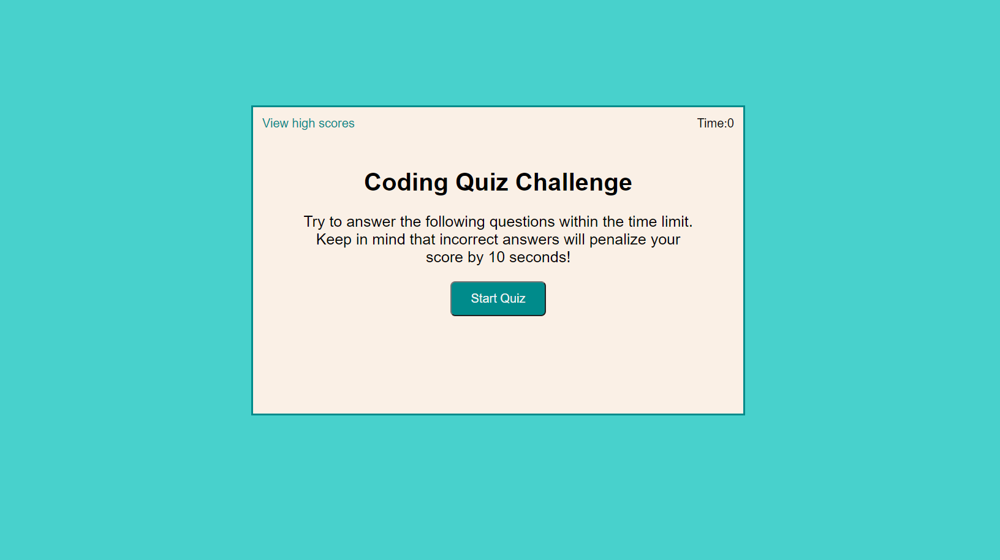

# Supreme Train (Code Quiz)

## Description:

This application is timed coding quiz with multiple-choice questions.

##  Table of Contents

* [Demo](#demo)
* [Technology](#technology)
* [Usage](#usage)
* [License](#license)
* [Questions](#questions)

## Demo: 
* Screenshot: 

* Deployed link: [https://tari-star.github.io/supreme-train/](https://tari-star.github.io/supreme-train/)

* Repository link: [https://github.com/Tari-Star/supreme-train.git](https://github.com/Tari-Star/supreme-train.git)

## Technology:
* ***JavaScript***
* ***CSS***
* ***HTML***

## Usage:
* When users click the start button, a timer starts and they presented with questions.
* Users answer a question, they presenred with another question.
* If users answer a question incorrectly, time subtracted from the clock.
* When all questions answered or timer reaches zero, then game is over.
* When game is over, users can save their initials and score.

 ## License

    
  > This project is licensed under the [MIT license](https://choosealicense.com/licenses/mit) 
    
    
  
   ---
   
  ## Questions?

   
  
  
  For any questions about the repo, please contact me with the information below:
  
 > To open an issue:
 
 GitHub/Issues: [@Tari-Star](https://github.com/Tari-Star/supreme-train/issues)
 > Contact me directly:
  
 Email: [Gmail](mailto:tari.star.g@gmail.com)